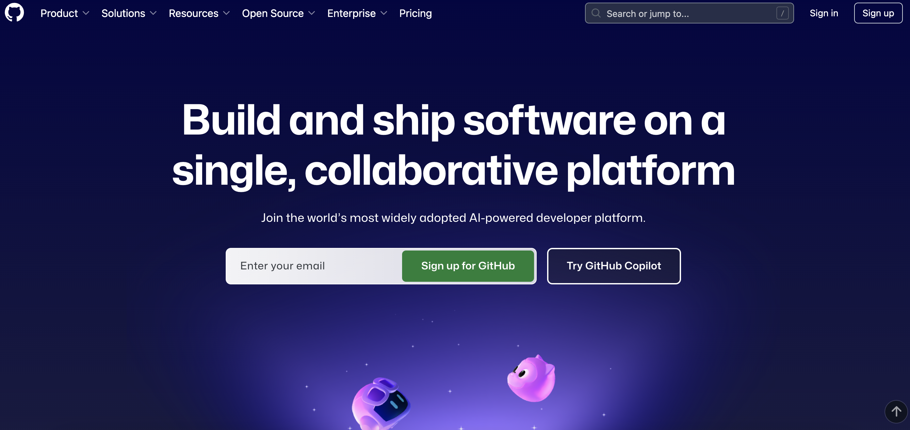
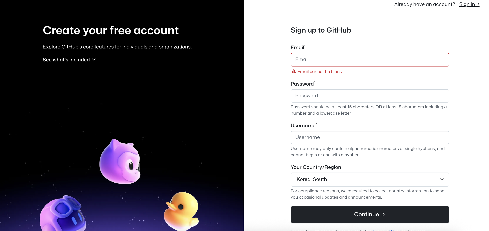

## 블로그 시작하기

Github 블로그 생성 기념으로 어렵고도 재미 Github 블로그 생성 방법 시작합니다.
단계 별로 생성하는 과정을 진행합니다. 문의사항은 댓글로 남겨주세요.(댓글 기능은 추후 업데이트 하겠습니다.)
 
블로그 생성은 현재 제 블로그 테마인 [Jekyll chirpy](https://github.com/cotes2020/jekyll-theme-chirpy){:target="_blank"} 테마를 적용할 예정입니다.

### ToDo list
- [ ] 깃허브 블로그 만들기
  - [x] Step 1 : 깃허브 계정 생성
  - [ ] Step 2 : 깃허브 블로그 repository 생성
  - [ ] Step 3 : 깃허브 블로그 세팅(로컬)
  - [ ] Step 4 : 깃허브 블로그 세팅(원격)
  
### 깃허브 계정 생성하기
## 1. 구글에 깃허브 검색 이후 접속 
 
[Github 이동](https://github.com){:target="_blank"}

## 2. Sign up 클릭

   

## 3. 회원가입 진행  
   

## 4. 계정 접속이 완료되었다면 다음 스텝을 확인해주세요. 
