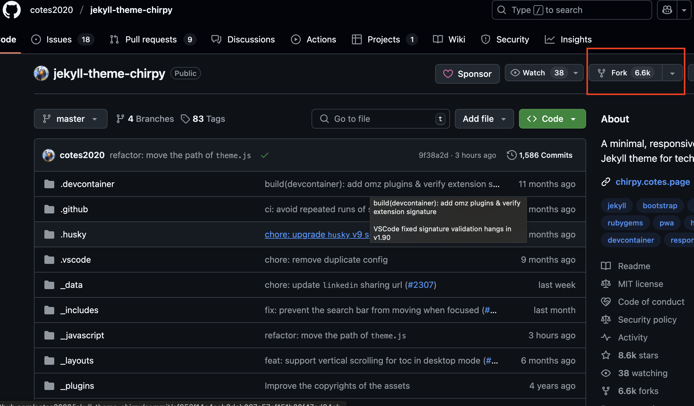
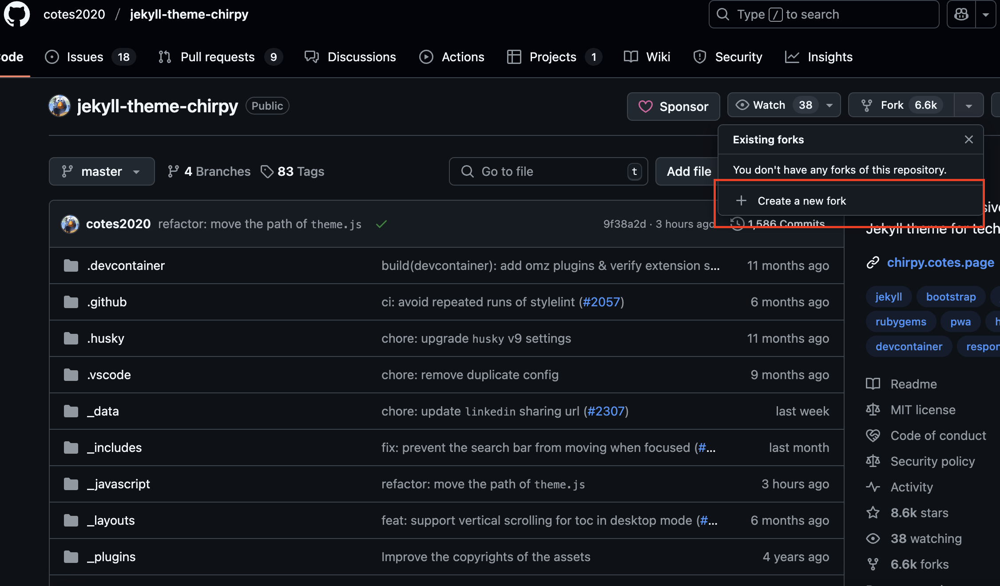
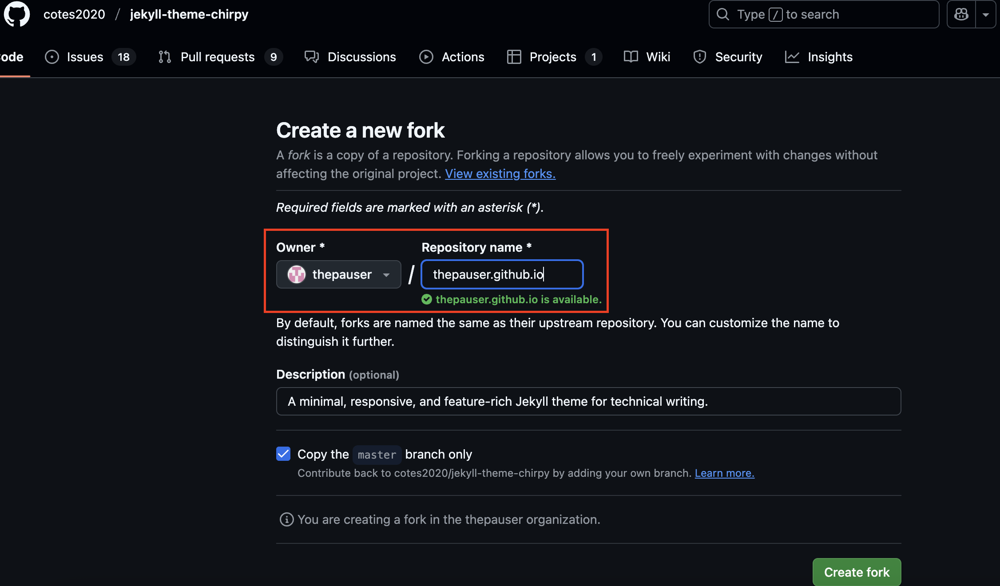
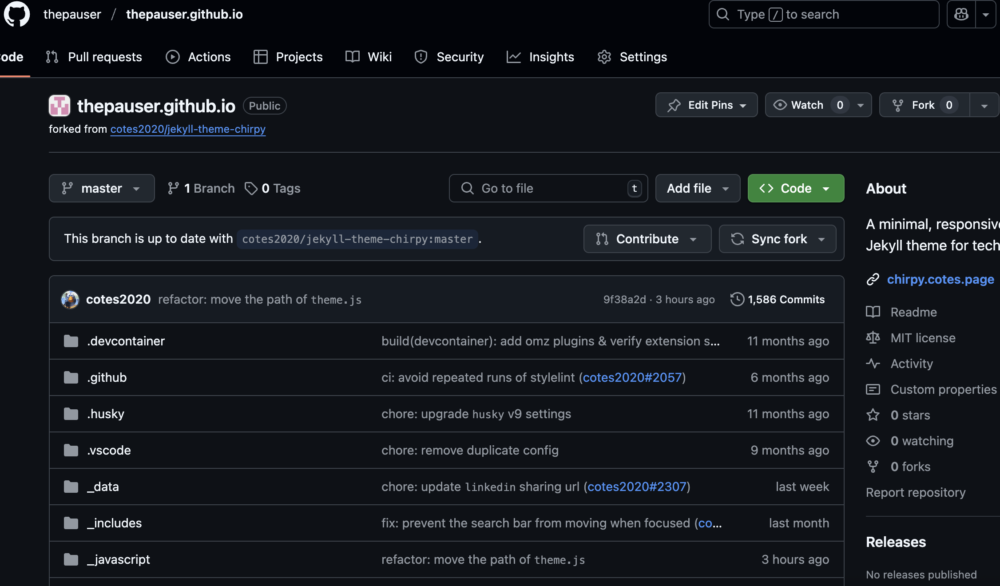

## 블로그 테마 고르기

깃허브 블로그 테마에는 오픈 소스로 공개된 다양한 종류가 있습니다.
굉장히 많은 종류가 있어 탐방해보시길 추천 드립니다.
 
[블로그 테마](http://jekyllthemes.org){:target="_blank"}

저는 이 중에서 제가 고른 테마인 [Jekyll chirpy](https://github.com/cotes2020/jekyll-theme-chirpy){:target="_blank"}로 생성 가이드를 진행해보겠습니다.

### ToDo list
- [ ] 깃허브 블로그 만들기
  - [x] Step 1 : 깃허브 계정 생성
  - [x] Step 2 : 깃허브 블로그 repository 생성
  - [ ] Step 3 : 깃허브 블로그 세팅(로컬)
  - [ ] Step 4 : 깃허브 블로그 세팅(원격)
  
### 깃허브 블로그 repository 생성
깃허브 블로그를 사용하기 위해 원격 repository를 생성합니다.

## 1. chirpy github 이동
 
[Jekyll chirpy](https://github.com/cotes2020/jekyll-theme-chirpy){:target="_blank"}

## 2. chirpy 프로젝트 Fork

   
   

## 3. 나의 계정명으로 repository 생성  
{나의 계정명}.github.io를 repository name으로 설정합니다.
(내 깃허브 블로그 주소가 됩니다.)
   

## 4. Create fork 버튼을 눌러 생성되었다면 다음 스템을 확인해주세요.
   

