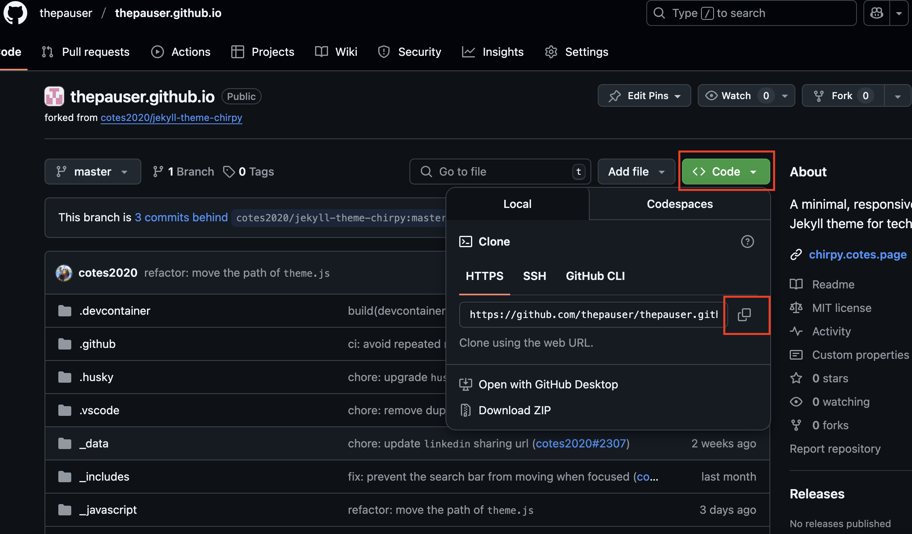
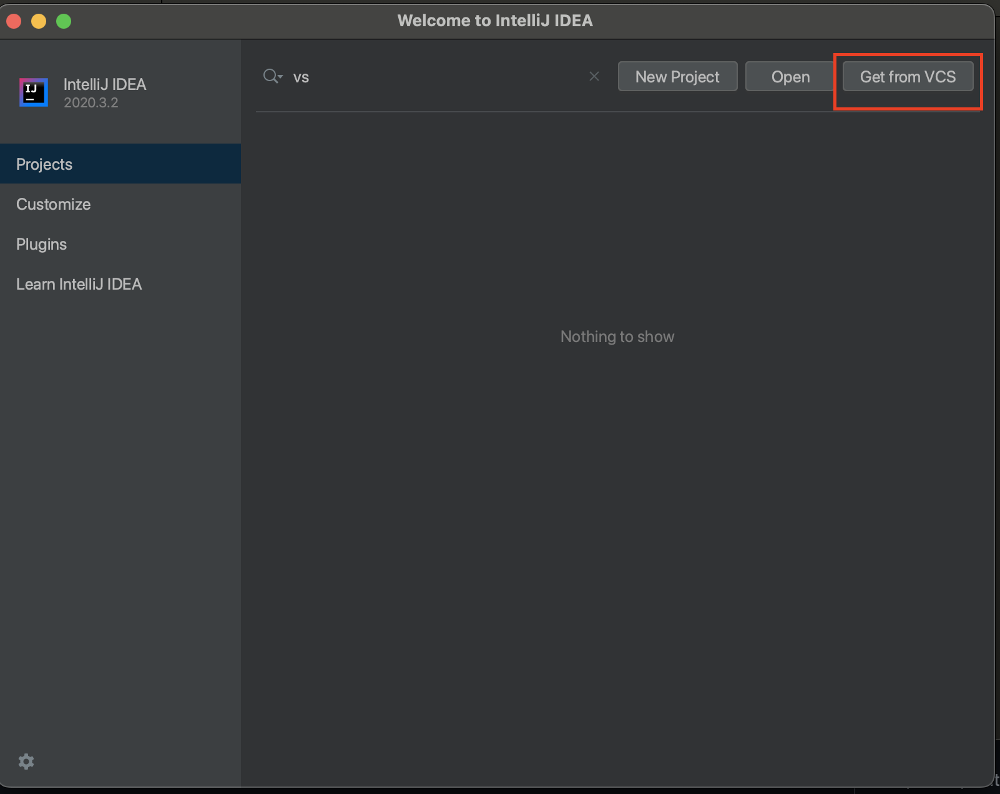
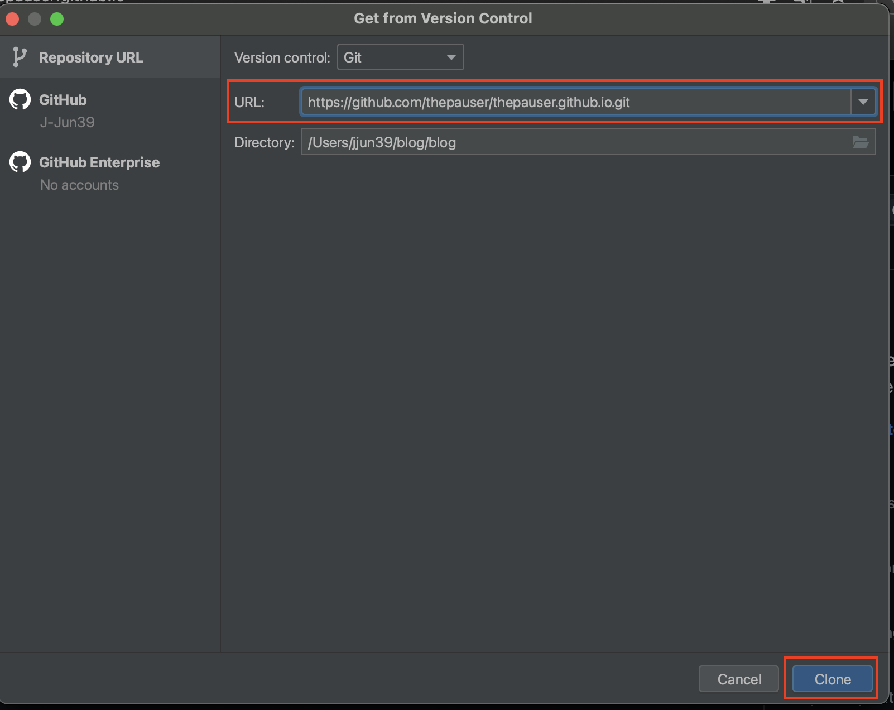
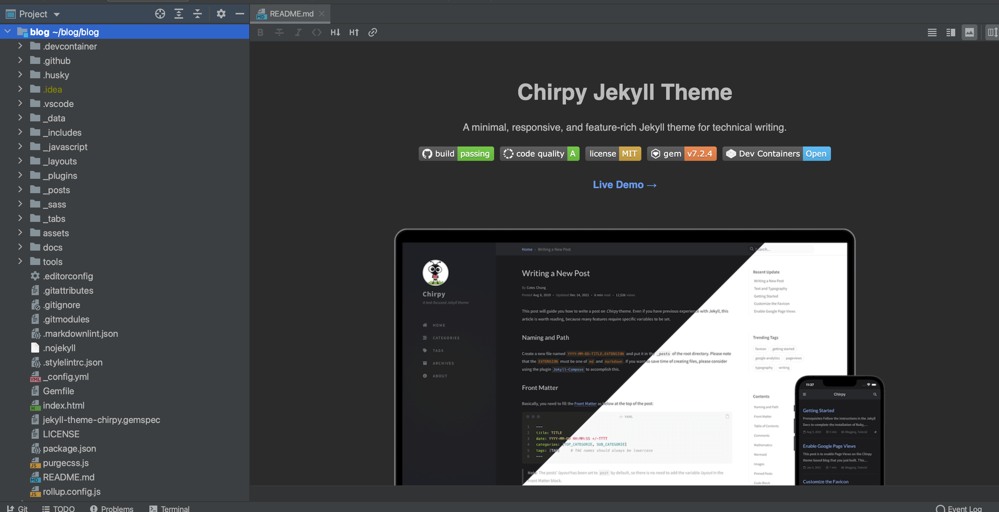

## 블로그 로컬 환경 세팅하기

깃허브 블로그는 로컬 환경에서 미리 서버를 띄워 확인을 해볼 수 있습니다. 로컬 환경에서 미리 적용해보기 위해서는 몇 가지 환경 세팅이 필요합니다.
 

	•	Ruby: 생산성과 간결함에 중점을 둔 범용 프로그래밍 언어
	•	Jekyll: Ruby 기반 정적 사이트 생성기
	•	Bundler: Ruby 프로젝트의 gem(라이브러리) 의존성 관리 도구
	•	npm: Node.js 생태계의 패키지(라이브러리) 관리 도구

•	Windows를 사용한다면 WSL 사용을 권장합니다.(명령어로 간결하게 패키지 설치가 가능합니다.)
 
•	Ruby: Jekyll은 Ruby 기반이므로 Ruby(최소 3.x 버전)를 설치해야 합니다.
 
(Mac 사용자들은 기본적으로 2.x 버전이 설치되어 있어 버전업이 필요합니다.)
 
•	Bundler: Ruby Gem 패키지 관리 도구로, gem install bundler로 설치합니다.
 
•	Jekyll: Ruby로 설치, gem install jekyll로 설치합니다.
 
•	npm(Node.js): 자바스크립트 빌드를 위해 필요합니다.

### ToDo list
- [ ] 깃허브 블로그 만들기
  - [x] Step 1 : 깃허브 계정 생성
  - [x] Step 2 : 깃허브 블로그 repository 생성
  - [x] Step 3 : 깃허브 블로그 세팅(로컬)
  - [ ] Step 4 : 깃허브 블로그 세팅(원격)
  
### 깃허브 블로그 로컬 clone
먼저 소스를 로컬 환경으로 clone하여 내려받습니다.
저는 intelliJ를 사용하여 블로그를 쓰고 있습니다.

## 1. github 이동
앞서 fork했던 github 경로로 이동합니다.
 
Code > 빨간색 네모 버튼을 누르면 clone에 사용할 링크가 복사됩니다.
  

## 2. intelliJ를 사용하여 로컬로 clone
Get from VCS 버튼을 눌러 github에 있는 소스를 clone합니다.

 
빨간색 네모에 앞서 복사한 링크를 붙여놓고 clone 버튼을 클릭합니다.
 

## 3. clone 확인
chirpy테마 소스가 로컬로 클론된 것을 확인합니다.
   
