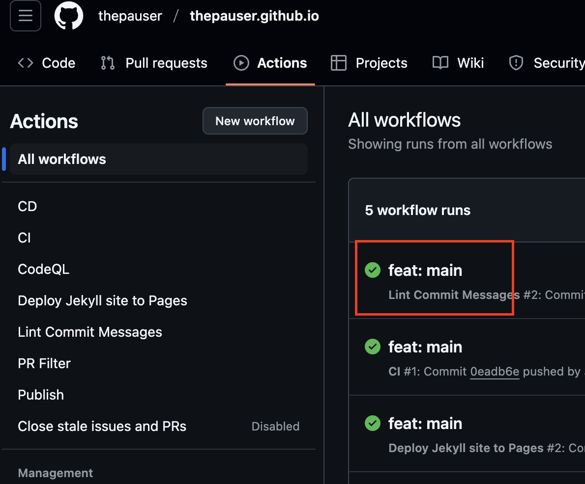
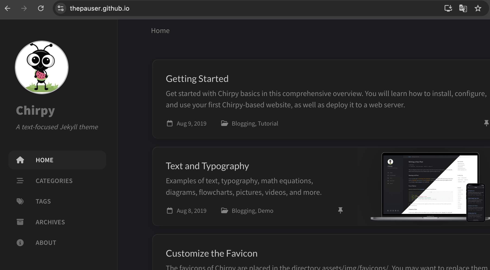

## 블로그 댓글 기능 세팅하기

블로그에 댓글을 달 수 있도록 Utterances 기능을 적용해보도록 하겠습니다.
<br>

### ToDo list
- [x] 깃허브 댓글 기능 세팅
  - [x] Step 1 : config.yml 수정
  - [x] Step 2 : Utterances 설치
  - [x] Step 3 : post에 댓글 기능 적용
  

## Step 1. _config.yml 수정


## 2. 로컬 소스 push
빌드를 성공하기 위해서는 push가 필요합니다.
intelliJ의 내 프로젝트로 돌아옵니다.

<br>
프로젝트의 .gitignore 파일에 들어가서
아래 2줄을 주석처리합니다. 해당 파일이 원격 저장소에 push되어야 정상적으로 빌드가 진행됩니다.


git commit은 아래 형식을 지켜야 정상적으로 진행 됩니다. 
```bash
git add .
git commit -m "feat: 블로그 시작"
git push
```

## 3. Git actions 확인
push 이후 git actions 탭에 들어가보면 정상적으로 빌드된 것을 볼 수 있습니다.


## 4. 블로그 확인
빌드 정상 확인 이후에 블로그 주소로 접속해보면 아래와 같이 화면이 보입니다.
<br>
https://{github아이디}.github.io



## 5. 블로그 확인 이후
여기까지 오신 분들 모두 고생하셨습니다. 이후의 과정은 SEO, 애드센스 등 수익을 얻기 위한 과정과 블로그를 커스텀하기 위한 기본 정보들을
작성해볼 예정입니다.
