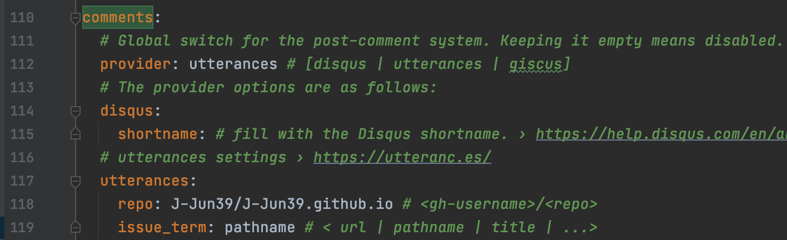
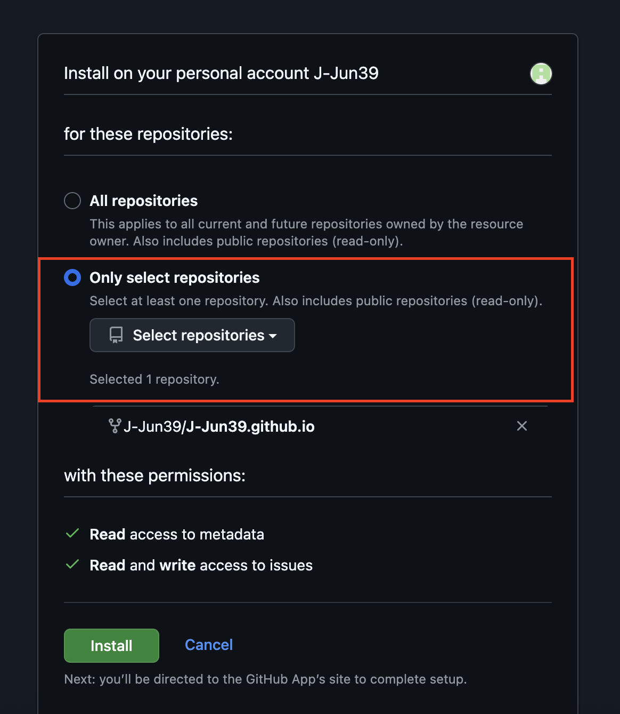
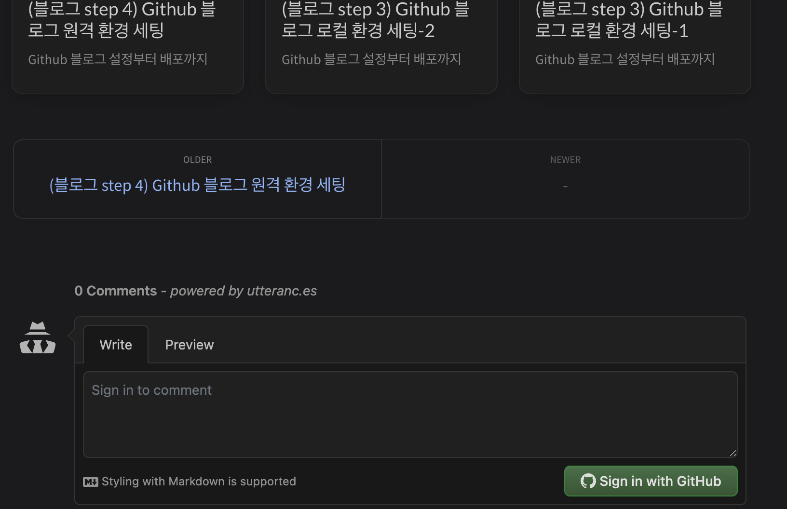

## 블로그 댓글 기능 세팅하기

블로그에 댓글을 달 수 있도록 Utterances 기능을 적용해보도록 하겠습니다.
<br>

### ToDo list
- [x] 깃허브 댓글 기능 세팅
  - [x] Step 1 : config.yml 수정
  - [x] Step 2 : Utterances 설치
  

## Step 1. _config.yml 수정

_config.yml 파일의 comments를 찾아 아래와 같이 수정합니다.
repo는 username/repo 순으로 작성해줍니다.

```yaml
comments:
  # Global switch for the post-comment system. Keeping it empty means disabled.
  provider: utterances # [disqus | utterances | giscus]
  # The provider options are as follows:
  utterances:
    repo: J-Jun39/J-Jun39.github.io # <gh-username>/<repo>
    issue_term: pathname # < url | pathname | title | ...>
```




## Step 2. Utterances 설치
다음은 내 repo에 Utterances를 설치해줍니다.

[Utterances](https://github.com/apps/utterances/) 링크를 클릭해서 아래 순서에 따라 진행해주세요.


댓글 기능을 연결할 계정을 선택해주세요.


블로그에만 댓글 서비스가 적용되도록 옵션을 선택해주세요.


설치 완료 이후에 서버를 기동해보면 댓글 기능 활성화를 확인하실 수 있습니다.


