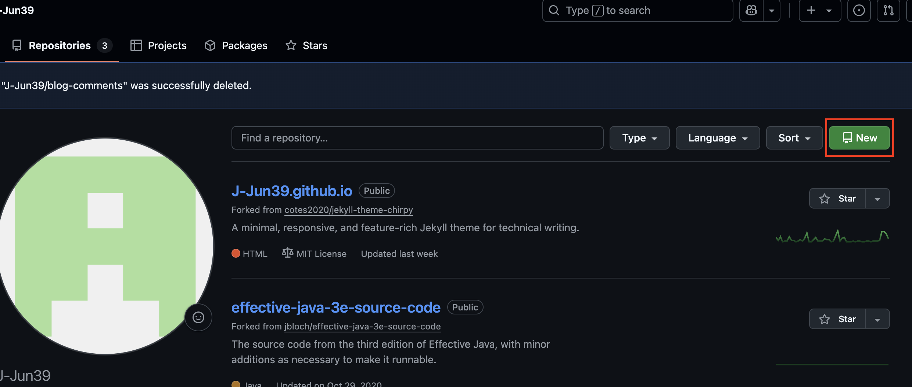
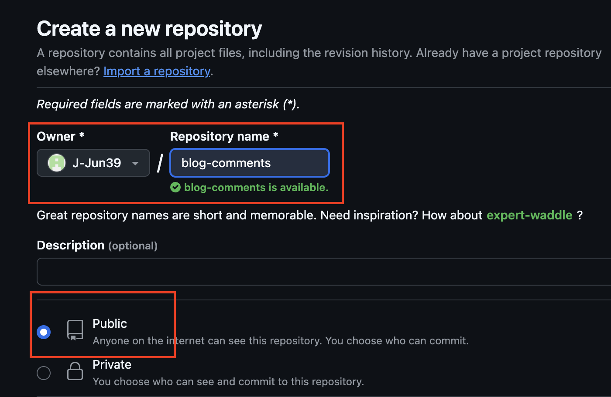
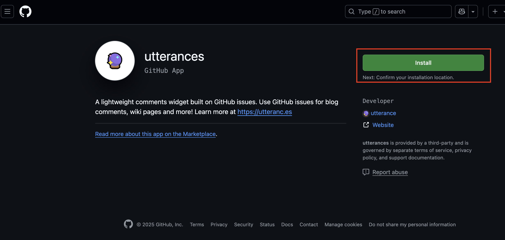
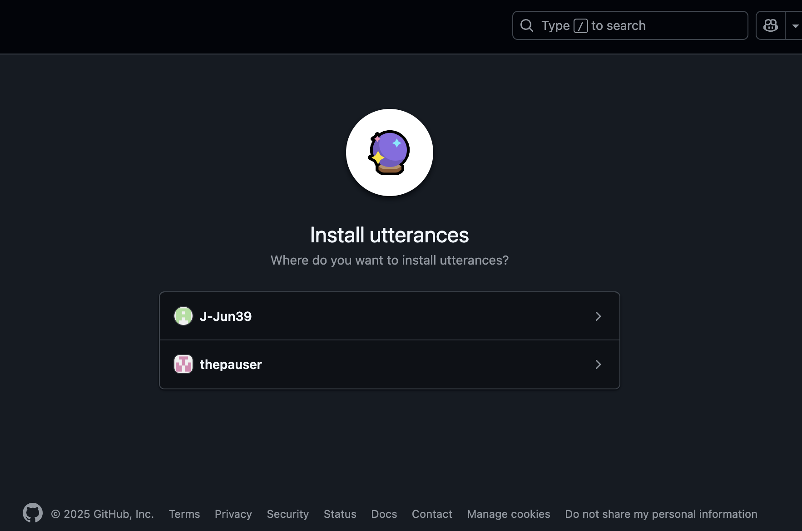
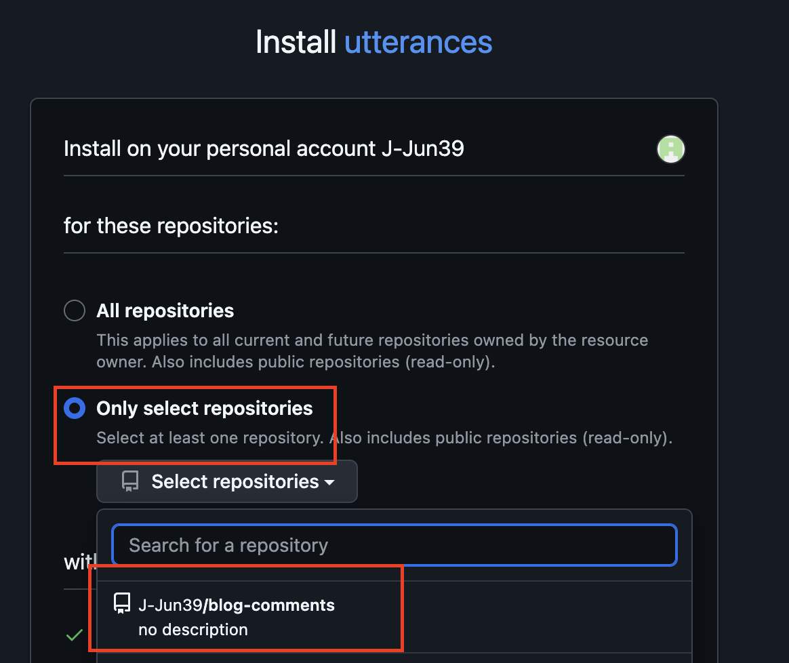
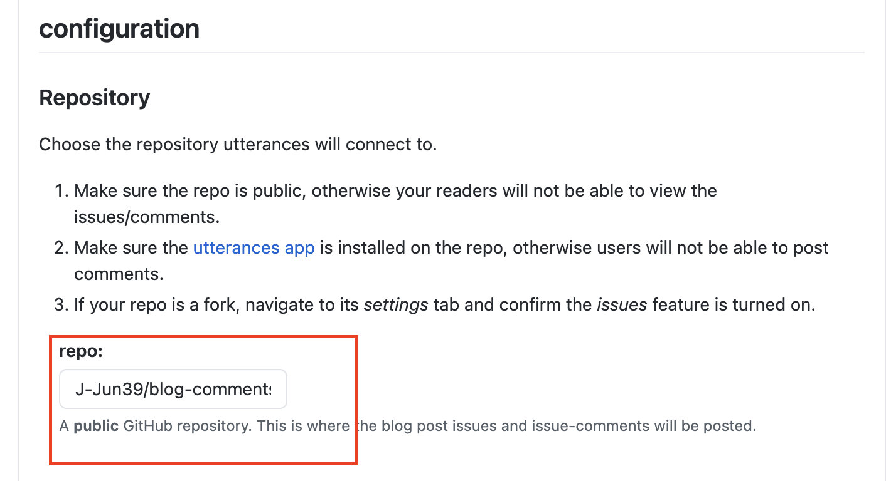
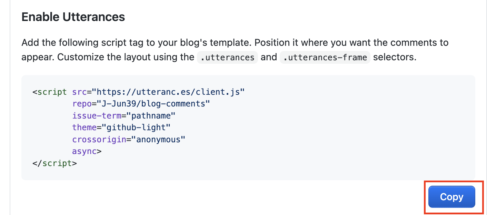
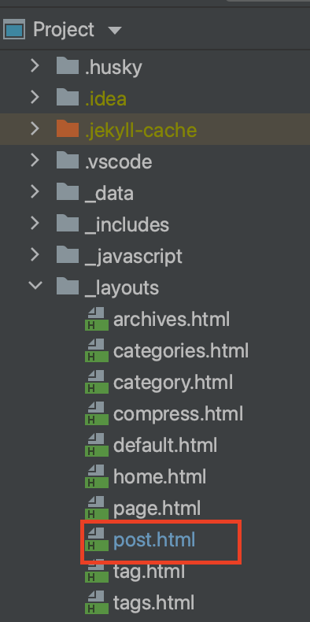
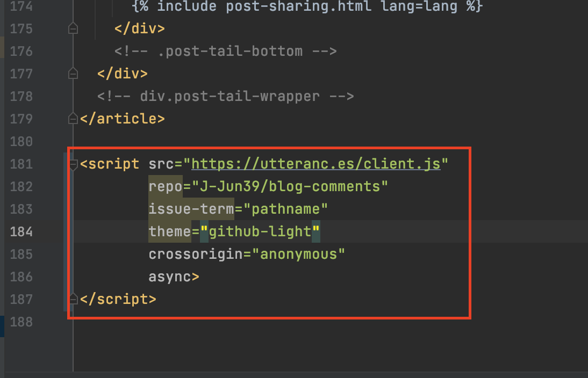

## 블로그 댓글 기능 세팅하기

블로그에 댓글을 달 수 있도록 Utterances 기능을 적용해보도록 하겠습니다.
 

### ToDo list
- [x] 깃허브 댓글 기능 세팅
  - [x] Step 1 : 댓글 관리용 repository 생성
  - [x] Step 2 : Utterances 설치
  - [x] Step 3 : Utterances 적용
  

## Step 1. 댓글 관리용 repository 생성

댓글을 관리하는 전용 repository를 생성하겠습니다.
저는 blog-comments라는 repository로 생성해보도록 하겠습니다.
 

repository 탭에서 New 버튼을 눌러 repository를 만들어 줍니다.

저는 blog-comments라는 이름으로 repository를 만들어 주겠습니다.
Public repository로 설정합니다.

## Step 2. Utterances 설치
다음은 내 repo에 Utterances를 설치해줍니다.

[Utterances](https://github.com/apps/utterances/) 링크를 클릭해서 아래 순서에 따라 진행해주세요.

댓글 기능을 연결할 계정을 선택해주세요.

블로그에만 댓글 서비스가 적용되도록 옵션을 선택해주세요.

Install 이후에 Utterances 화면으로 돌아오면 댓글 설정한 repository를 아래 칸에 입력합니다.
[Username]/[repository] 순서로 입력합니다.
저의 경우에는 J-Jun39/blog-comments입니다.

다음으로 스크롤을 밑으로 내려 아래 화면에 자신의 Repo가 자동 입력되어 있는 것을 확인하면 copy 버튼을 눌러 복사합니다.

## Step 3. Utterances 적용
위에서 copy한 내용을 전체 포스트에 적용하기 위해서 post.html 파일에 적용하겠습니다.
post.html 파일을 찾아줍니다. _layouts 폴더 하위에 있습니다.

파일에 들어가서 제일 하단부에 copy한 스크립트를 붙여넣습니다.

이후에 빌드를 해보면 댓글 기능이 활성화된 것을 확인할 수 있습니다.

